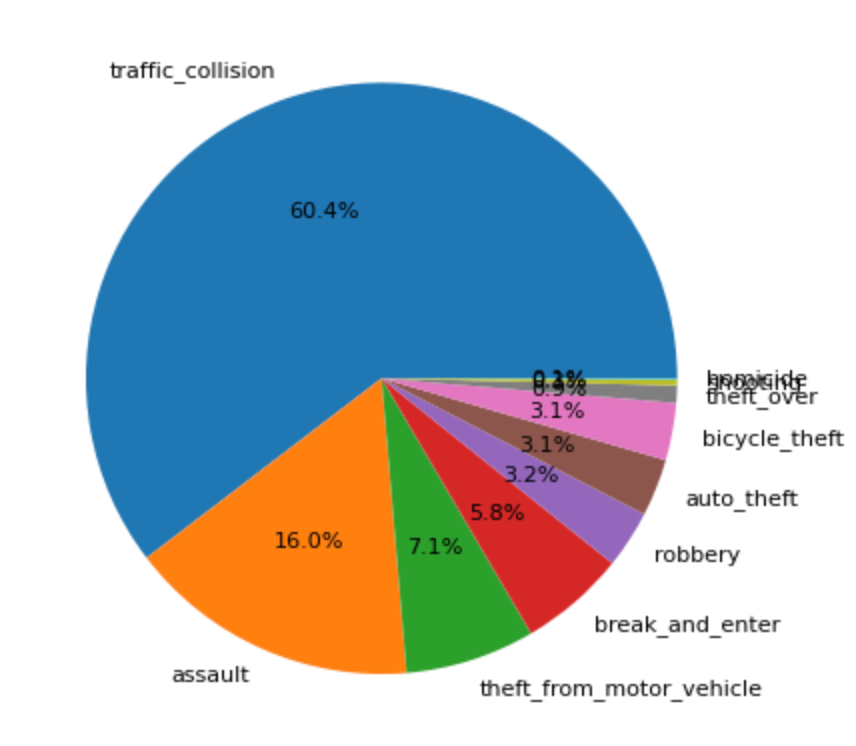
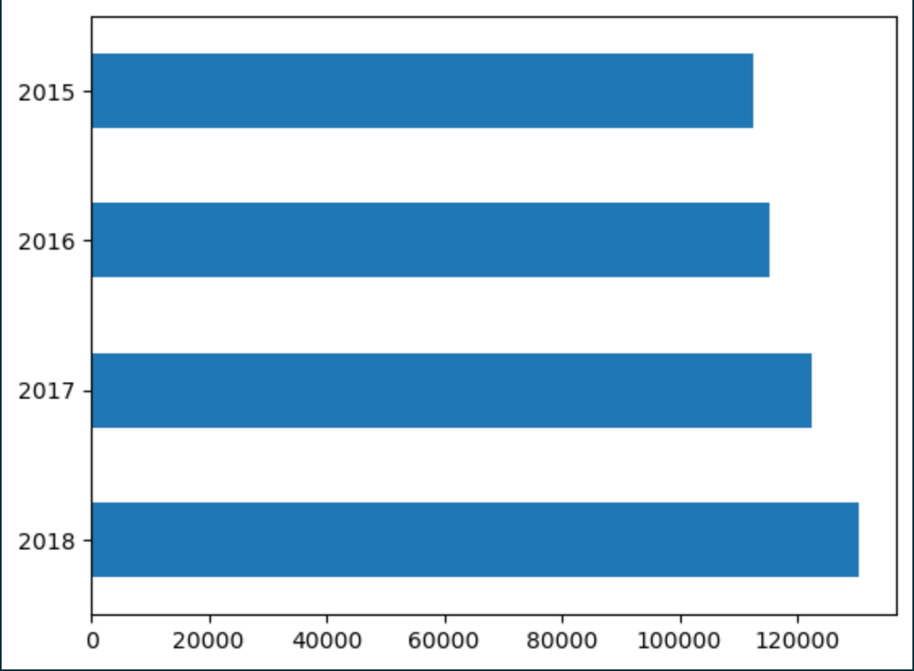

# Weather Impact on Crime Rates
An analysis of Crime Rates in the Greater Toronto Area with regard to the impact weather has on crime rates.

## Project Overview
Can weather be used to predict crime rates? Are changing weather patterns affecting crime rates?  
 
Weather plays a role in our daily lives, it shapes our choices and behaviors affecting when, where and how we choose to carry out our daily activities. Studies into the impact of weather on crime have been going on for decades but what about here and now? Forbes recently published an article “A Different Heatwave Warning: Online Hate—Like Violent Crime—Soars With High Temperatures”.   
We are taking a look at Toronto Crime rates from 2015 to 2018 to see if changes in weather have affected crime rates.

Outcome:  Can we predict higher precedence of crime based on weather forecasts?  Can Police Services use weather to predict higher staffing levels, increased surveillance in high crime areas based on the weather forecast?  If our climate is experiencing changes will these changes affect the long term police services needs and budget?

### Project Question
The purpose of this project is to analyze data to answer the following question: 
***Can changes in weather affect crime rates?***

### Outcome
Can we predict higher precedence of crime based on weather forecasts?  Provide Police services an interactive resource that can be used to evaluate the effect of weather on crime trends. Can Police Services use weather to predict higher staffing levels, increased surveillance in high crime areas based on the weather forecast?  If our climate is experiencing changes will these changes affect the long term police services needs and budget?

### Technologies

- Python
- Jupyter Notebooks
- Database (PostgreSQL), SQLAlchemy
- Machine Learning - Linear Regression model(s)
- Neural Networks, Keras
- Tableau

### Data Set - Initial Raw Data  (num of rows, size, )

* Cleaned Data files can be found here: [cleaned_data_2015_2018](https://github.com/MickMarch/Weather_Impact_On_Crime_Rates/tree/main/cleaned_data_2015_2018)

* Source: Data has been sourced from the Toronto Police Service Data Catalogue. [cleaned_data_2015_2018](https://data.torontopolice.on.ca/pages/catalogue)
    * Source raw data can be found here: The exception is the Major Crimes CSV (over 100 M).  Download the file here : [Raw Data - Major Crimes Indicators](https://data.torontopolice.on.ca/datasets/TorontoPS::major-crime-indicators-open-data/about)

### Data Set - Data Cleaning

### Data Exploration
https://github.com/MickMarch/Weather_Impact_On_Crime_Rates/tree/main/Project_Notebooks/Data_Exploration

Crime dataset: 
The cleaned crime dataset has 480, 903 rows and 12 columns. There are 10 different crime types with traffic collisions comprising 60% of the dataset. 

Since weather obviously has an impact on traffic collisions, we decided to remove this crime type from the analysis. 

We also see that crime is slightly increasing over time, pointing to a need to figure out how to reduce crime and prevent further increases. 

There are no null values within the dataset except for 1,811 rows (0.38% of the dataset) with no premise type (this is where the crime took place, i.e. an apartment, outside, etc). 

Weather dataset: 
There are 1,461 rows and 13 columns. This includes the date, max temp, min temp, max humidity, avg humidity, avg sea pressure, max wind speed, precipitation, rain, snow, snow on ground, daylight and avg cloud cover. During this time period, the max temperature in Toronto was 36 degrees and the min temperature was -26.3 degrees. 

### Data Pre-Processing

### Machine Learning 

### Neural Network Modelling

### Visualizations 
 https://public.tableau.com/app/profile/nitasha.gill/viz/Crime_Weather_16836768522530/CrimeDash?publish=yes

## Project Roles and Activities

* Focus areas:
    * Data cleaning - Michael 
    * Data base PostgreSQL - Susan
    * Visualization and data exploration - Nitasha
  
* Communication Protocols:
- branch management
- additional team meetings (MS Teams)
- Slack group
- Task management spreadsheet
- Each one owns tasks and updates status as task and deliverable are completed

### Segment 1 Deliverables
* Presentation      - mock-ups, README
* GitHub            - complete, branching in progress
* Machine Learning  - Data exploration
* Machine Learning models mock-up - [Model(s) Mock-up](https://github.com/MickMarch/Weather_Impact_On_Crime_Rates/tree/main/NN_Model)
* Database          - [Postgress Mock-up](https://github.com/MickMarch/Weather_Impact_On_Crime_Rates/tree/main/PosgreSQL)
    * [ERD Mock-up](https://github.com/MickMarch/Weather_Impact_On_Crime_Rates/blob/main/PosgreSQL/ERD_mockup_Segment1.png)
* Dashboard         - [Dashboard Mock-up](https://github.com/MickMarch/Weather_Impact_On_Crime_Rates/blob/main/Dashboard_Mockup.pptx) 
    
    

