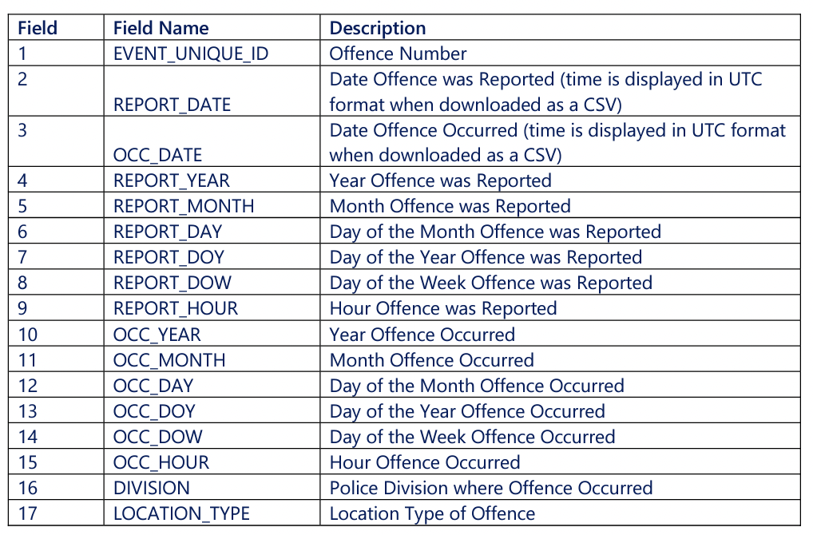
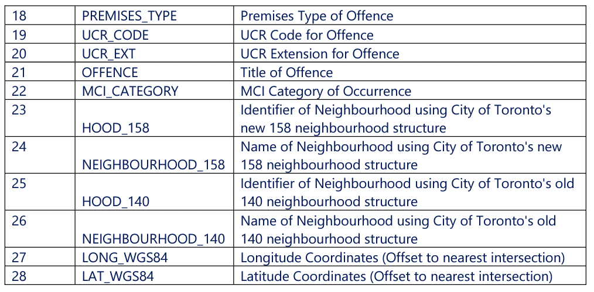

# Weather Impact on Crime Rates
An analysis of Crime Rates in the Greater Toronto Area with regard to the impact weather has on crime rates.

## Project Overview

### Purpose
The purpose of this project is to analyze data to answer the following question:
***Can changes in weather affect crime rates?***

### Technologies

- Python
- Jupyter Notebooks
- Machine Learning
- Database (PostgreSQL)
- Tableau

### Data Set
Data has been sourced from the Toronto Police Service Data Catalogue. 
https://data.torontopolice.on.ca/pages/catalogue

Raw data csv files can be found in the datasets folder within the GitHub repository.  The exception is the Major Crimes CSV (over 100 M).  Download the file here : https://data.torontopolice.on.ca/datasets/TorontoPS::major-crime-indicators-open-data/about

The crime data columns glossary:

### Project Roles and Activities
* Focus areas:
    * Data cleaning - Michael 
    * Data base PostgreSQL - Susan 
    * Visualization - Nitasha

## Deliverables

### Segment 1 Deliverables
* Presentation      - ??
* GitHub            - complete
* Machine Learning  - 
* Database          -
* Dashboard         - 

