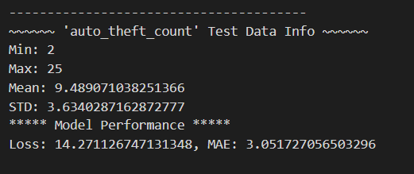
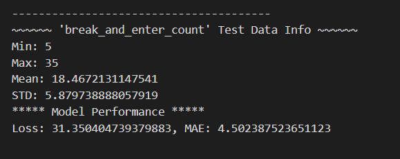
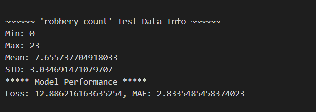
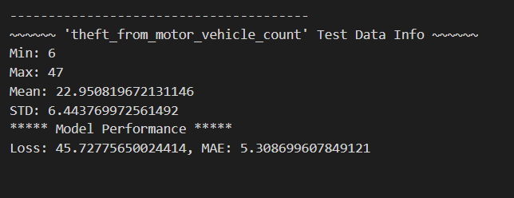

# Weather Impact on Crime Rates
An analysis of Crime Rates in the Greater Toronto Area with regard to the impact weather has on crime rates.

## Project Overview
Can weather be used to predict crime rates? Are changing weather patterns affecting crime rates?  
 
Weather plays a role in our daily lives, it shapes our choices and behaviors affecting when, where and how we choose to carry out our daily activities. Studies into the impact of weather on crime have been going on for decades but what about here and now? Forbes recently published an article “A Different Heatwave Warning: Online Hate—Like Violent Crime—Soars With High Temperatures”.   
We are taking a look at Toronto Crime rates from 2015 to 2018 to see if changes in weather have affected crime rates.

### Project Question
The purpose of this project is to analyze data to answer the following question: 
***Can changes in weather affect crime rates?***

### Outcome
Can we predict higher precedence of crime based on weather forecasts?  Provide Police services an interactive resource that can be used to evaluate the effect of weather on crime trends. Can Police Services use weather to predict higher staffing levels, increased surveillance in high crime areas based on the weather forecast?  If our climate is experiencing changes will these changes affect the long term police services needs and budget?

### Technologies

- Python
- Jupyter Notebooks
- Database (PostgreSQL), SQLAlchemy
- Machine Learning - Linear Regression model(s)
- Neural Networks, Keras
- Tableau

## Initial Data

All raw data used in this project can be found here: [Repository Datasets](./Data/datasets/)

### Source Data

#### Crime Data

The crime data used in this project comes from [The Toronto Police Service Data Catalogue](https://data.torontopolice.on.ca/pages/catalogue).

The crime data sets used: 

| Type of Crime Data | Row Count |
-------------------|----------
| Assault_Open_Data.csv | 173239 |
| Auto_Theft_Open_Data.csv | 46049 |
| Bicycle_Thefts_Open_Data.csv | 31971 |
| Break_and_Enter_Open_Data.csv | 62528 |
| Homicides_Open_Data_ASR_RC_TBL_002.csv | 1323 |
| Robbery_Open_Data.csv | 30739 |
| Shooting_and_Firearm_Discharges_Open_Data.csv | 5708 |
| Theft_From_Motor_Vehicle_Open_Data.csv | 81652 |
| Theft_Over_Open_Data.csv | 10746 |
| Traffic_Collisions_(ASR-T-TBL-001).csv | 553781 |

This data contains information which was considered interesting to this project:
* EVENT_UNIQUE_ID
* OCC_DATE (***OCC** = Occurrence*)
* OCC_YEAR
* OCC_MONTH
* OCC_DAY
* OCC_DOW
* OCC_HOUR
* PREMISES_TYPE
* MCI_CATEGORY (***MCI** = Major Crime Indicators*)
* HOOD_140 (*This refers to the 140 neighbourhood division of Toronto*)
* NEIGHBOURHOOD_140 (*This refers to the 140 neighbourhood division of Toronto*)
* LONG_WGS84 (*Longitude*)
* LAT_WGS84 (*Latitude*)

#### Daily Weather Data

The daily weather data used in this project comes from [toronto.weatherstats.com](https://toronto.weatherstats.ca/download.html).

**weatherstats.com** [quote](https://www.weatherstats.ca/faq/#data-source): *Data is collected over time from Environment and Climate Change Canada and from the Citizen Weather Observer Program (CWOP). Every individual location web site has several links on the "about page" so you can see where the information came from.*

This data contains information which was considered interesting to this project:
* date
* max_temperature
* min_temperature
* max_relative_humidity
* avg_relative_humidity
* avg_pressure_sea
* max_wind_speed
* precipitation
* rain
* snow
* snow_on_ground
* daylight
* avg_cloud_cover_8

## Data Cleaning

### Crime Data

1. The first thing needed was to reduce the columns to the desired data mentioned above in [Crime Data](#crime-data).
2. The most important thing for the cleanup of the crime data was to convert the `OCC_DAY`, `OCC_MONTH`, and `OCC_YEAR` to a datetime object. 
3. Then the data was filtered by year. 

### Weather Data

1. The first thing needed was to reduce the columns to the desired data mentioned above in [Weather Data](#weather-data).
2. Next, all `NaN` values were filled with `0`. This was because the columns which had the `NaN` values were realistic in having days where the value was `0`

3. The `date` column was converted to a datetime object and used to filter by years for the selected range of this project.

## Data Exploration
https://github.com/MickMarch/Weather_Impact_On_Crime_Rates/tree/main/Project_Notebooks/Data_Exploration

Crime dataset: 
The cleaned crime dataset has 480, 903 rows and 12 columns. There are 10 different crime types with traffic collisions comprising 60% of the dataset. 

Since weather obviously has an impact on traffic collisions, we decided to remove this crime type from the analysis. 

We also see that crime is slightly increasing over time, pointing to a need to figure out how to reduce crime and prevent further increases. 

There are no null values within the dataset except for 1,811 rows (0.38% of the dataset) with no premise type (this is where the crime took place, i.e. an apartment, outside, etc). 

Weather dataset: 
There are 1,461 rows and 13 columns. This includes the date, max temp, min temp, max humidity, avg humidity, avg sea pressure, max wind speed, precipitation, rain, snow, snow on ground, daylight and avg cloud cover. During this time period, the max temperature in Toronto was 36 degrees and the min temperature was -26.3 degrees. 

## Model Exploration

### Machine Learning 
Initial investigation into machine learning delivered interesting insights into how different types of weather events effect different types of crime.  

For each Linear Regression model preprocessing of the data was performed.
* data pulled from PostgreSQL tables; All Crime table and Weather table
* 'crime' column was grouped by date and day of the week (occ_dow) and split into seperate columns containing the individual crime types, and crime events were totalal by type/date.
* crime data and weather data was merged into a single data set
     
* each crime type was isolated and tested against the weather feature focused in the notebook. A scatter diagram, and correlation matrix was built for each crime type

### Linear Regression
Several Linear Regression notebooks were created targeting specific weather events; 
- Max Temp (maximum temperature during a given day), 
- Precipitation (includes rain or snow), 
- Pressure (average sea level pressure at the reading station), and 
- Snow on the Ground (snow accumulation).

<b>Precipitation :</b> 
Although one might think initially that this would have a high effect on crime, it turned out the be the least impactful of the 4 weather features.  Not surprisingly bicycle theft did have a significant decline as precipitation increased.  However the overall slope was negligable. 

<b>Air Pressure :</b> 
It has been noted that on many levels changes in air pressure can effect the human body from the sounds we hear to our emotions such as irritability.  A lower air pressure has a consistent relation to an increase in certain types of crime. 

<b>Higher Temperature :<b> 
Temperature as well can effect the human condition.  High temperatures had the strongest effect on increases in crime.   

<b>Snow on the Ground :<b> 
While precipitation itself didn't show a significant correlation accumulation of snow on the ground had a higher relationship to certain crimes.    

### <b>Correlation Matrix </b> 
A correlation matrix was run in each of the weather feature Linear Regression notebooks by crime type.  Also a Correlation Matrix was run on groupings of crime types. 

<b>Bicycle theft, Theft from a motor vehicle and Theft Over:</b> 
A clear picture shows a high correlation between max temperature and bicycle theft confirming that connection.  Also a correlation between max temp and theft from a motor vehicle.

<b>Auto Theft, Brean and Enter, and Robbery:</b> 
These type had a common correlation level between the key weather features.  Through the correlation matrix below and regression modelling these had consistenly higher relevance.

<b>Assault, Homicide and Shoortings:</b> 
The correlation matrix shows some correlation to these more serious events with max temperature and assault having the highest correlation.  Homicide however consistently has a lower correlation and regression predictability and with shooting (firearms events)

### Machine Learning Summary
Between the Linear Regression and Correlation matrices it was clear that certain types of crime did not have a clear correlation to weather.  Homicide for example was consistently flat in the linear regression and very low in the corrleation matrix. 

This machine learning analysis can be used to focus the Neural Network tuning to ensure a cleaner and more effective model.  There were 5 types of crime that were consistently higher in correleation:
* Thefts: Bicycle Theft, Theft from an Auto, Auto Theft, Robbery, Break and Enter.

### Neural Network Modelling

#### Data Pre-Processing

The steps for pre-processing the data are as follows:
1. Group the data by date, and form the data into a daily representation of weather and crime stats
2. From the insights gathered in the [Data Exploration](#data-exploration), the `date` seemed to play a role in a natural increase of crime. This insight led to converting the `date` to a `unix timestamp` for the Neural Network.
3. `OneHotEncoder()` was used to label encode the `occ_dow`, which is a Monday to Sunday value
4. `date` and `occ_dow` columns were removed.
5. Features and Target columns were separated

#### Model

- Using `python` and `tensorflow`, a `keras` `Sequential()` regression model was built that focussed heavily on `RELU` nodes in the hidden layers.

- The Loss function was based on `MSE` (mean squared error)

- The metric being measured was `MAE` (Mean absolute error)

#### Results

The results for each prediction were to compare the `MAE` of the model to the `Mean` and the `STD` of the date being used for the prediction.

##### Assault

##### Auto Theft

##### Breaking and Entering

##### Bicycle Theft

##### Homicide

##### Robbery

##### Shooting

##### Theft From Motor Vehicle

##### Theft Over

## Visualizations 
https://public.tableau.com/app/profile/nitasha.gill/viz/Crime_Weather_16836768522530/CrimeDash?publish=yes

## Presentation
https://docs.google.com/presentation/d/1dLf7HKmSju-rneZXAh5zz0y7BerAy6eE/edit#slide=id.p1

## Project Roles and Activities

* Focus areas:
    * Data cleaning - Michael 
    * Data base PostgreSQL - Susan
    * Visualization and data exploration - Nitasha
  
* Communication Protocols:
- branch management
- additional team meetings (MS Teams)
- Slack group
- Task management spreadsheet
- Each one owns tasks and updates status as task and deliverable are completed

### Segment 1 Deliverables
* Presentation      - mock-ups, README
* GitHub            - complete, branching in progress
* Machine Learning  - Data exploration
* Machine Learning models mock-up - [Model(s) Mock-up](https://github.com/MickMarch/Weather_Impact_On_Crime_Rates/tree/main/NN_Model)
* Database          - [Postgress Mock-up](https://github.com/MickMarch/Weather_Impact_On_Crime_Rates/tree/main/PosgreSQL)
    * [ERD Mock-up](https://github.com/MickMarch/Weather_Impact_On_Crime_Rates/blob/main/PosgreSQL/ERD_mockup_Segment1.png)
* Dashboard         - [Dashboard Mock-up](./Doc_Assets/Dashboard_Mockup.png) 
    
 

    

